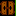

# Taller de programación 2: (20% de la nota final)

Se requiere elaborar una versión del legendario juego [BOMBERMAN NES](https://en.wikipedia.org/wiki/Bomberman_(1983_video_game)), utilizando como base el archivo [bomberman.zip](../../codigo/python3/juegos/bomberman.zip) y la librería [`pygame`](https://www.pygame.org/).

NOTA: en caso que encuentren un error en el programa suministrado, repórtenlo tan pronto sea posible para corregirlo.

# Forma de presentación
* Individual

# Fecha y hora límite de entrega: 
* Agosto 9 de 2019 a las 7:00 am; enviar a <daalvarez@unal.edu.co>. Sin excepción, por cada **HORA** de retraso en la entrega se rebajará **1.0 unidad** de la nota.

# Fecha y hora de la sustentación
* Agosto 9 de 2019, a partir de las 7:00 am, de acuerdo con el horario acordado con el profesor.

# Lo que debe programar
Lo pedido a continuación debe funcionar de forma similar al juego https://www.retrogames.cc/nes-games/bomberman-usa.html. Nota: el video https://www.youtube.com/watch?v=3smytj9Bu_E le puede ayudar a entender como funciona el juego. Ver adicionalmente: http://strategywiki.org/wiki/Bomberman 

El programa se calificará por objetivos de la siguiente forma:

## Puntos obligatorios
Los puntos obligatorios no otorgan unidades, solo las quitan, es decir un programa que solo tiene los puntos obligatorios tiene una nota de 0.0):

* El bomberman se debe mover correctamente cuando se presionan las flechas (**si no se realiza -5.0 unidades**).

* Las bombas se deben colocar con la tecla espacio y explotar después de 2 segundos (**si no se realiza -5.0 unidades**).

* Los muros suaves deben explotar si la onda explosiva de la onda los alcanza (**si no se realiza -5.0 unidades**).

* Si el bomberman toca el destello de una bomba o uno de los fantasmas, pierde una vida. Si se pierden todas las vidas se pierde el juego (**si no se realiza -5.0 unidades**).

* Debe demostrar durante la sustentación que se sabe manejar el depurador (**si no se realiza -5.0 unidades**). En YouTube encontrarán cientos de tutoriales al respecto. Busquen con las palabras clave  `buscando errores python`, `debugger python` y `depurador python`.
  * Para el SPYDER sugiero, adicionalmente, los siguientes tutoriales:
    - https://docs.spyder-ide.org/debugging.html
    - https://docs.spyder-ide.org/variableexplorer.html
    - https://realpython.com/python-debugging-pdb/

* En la parte superior del tablero debe haber un panel donde se muestren las vidas, el puntaje, un cronómetro que indique el tiempo de juego faltante (tiempo inicial: 180 segundos) y cualquier otra información de relevancia para el juego (**si no se realiza -1.0 unidad**).

 ## Puntos opcionales
* Hacer introducción del juego similar a la del original: (**+1.0 unidad**).

* Al presionar `H` o `h` aparece el manual de instrucciones del juego. Al aparecer la ayuda, el juego (incluyendo el cronómetro del tiempo) se para: (**+0.5 unidades**).

* Deben haber al menos 10 niveles de juego (cada tablero es más complejo). Debe mostrar el cuadro donde diga el número del nivel al que se pasa, tal y como sucede en el juego original; cada vez que se pasa de un nivel a otro, el número de las vidas del bomberman aumenta en uno. Sólo se pasará de nivel si todos los globos han sido exterminados y si se toca la puerta  para pasar niveles  (**+2.0 unidades**). Implementar una rutina que genere los muros suaves y las losetas de poder aleatoriamente (**+1.0 puntos**).

* Implementa los diferentes tipos de enemigos de modo que varios tipos de ellos aparezcan simultáneamente en el juego. No se puede repetir el código sino que debe modificarse las funciones de los globos para que maneje los diferentes tipos de enemigo.:
  * Globo: 100 puntos cuando muere (**si no se realiza -1.0 unidad**)
  * Cebolla: 200 puntos cuando muere  **(+0.5 puntos)**
  * Barril: 400 puntos cuando muere  **(+0.5 puntos)**
  * Moneda: 800 puntos cuando muere  **(+1.0 punto)**. Tiene el poder de perseguir al bomberman.
  * Amebas (1000 puntos cuando muere) y fantasmas (2000 puntos cuando muere): tienen la capacidad de atravesar muros. Se mueven más lento que los otros enemigos. **(+1.0 puntos cada uno)**
  * Oso: 4000 puntos cuando muere. Se mueve al doble de la velocidad que los globos  **(+0.5 puntos)**

* Cuando varios de estos enemigos mueren simultáneamente con la misma explosión, el número de puntos obtenidos se duplicará: **+0.5 unidades**.

* Cuando el bomberman muere ya sea por la explosión o porque toca un fantasma, el nivel reinicia (la presentación del nivel), y reinicia el nivel. La cantidad de vidas disminuye en una: **+1.0 unidades**.

* Cuando el último de los enemigos de un nivel dado muere, suena un sonido especial: **+0.5 unidades**.

* Debajo de los muros suaves existirán ciertas losetas que darán algunos poderes especiales. Dichas losetas aparecerán una vez se destruya el muro suave, y el bomberman obtendrá el poder especial una vez dicha loseta es tocada. Tenga en cuenta que los enemigos pueden atravesar todas estas losas sin dificultad.
Las losetas especiales se listan a continuación:

    * Losa que incrementa la velocidad de movimiento del bomberman  (**+0.5 unidades**).

    * Losa que permite incrementar el número de bombas que se pueden colocar simultáneamente en el tablero  (**+0.5 unidades**). Tenga en cuenta que al inicio del juego, el bomberman solo puede colocar una bomba.

    * Losa que incrementa la intensidad de explosión de una bomba en un cuadro a la redonda  (**+0.5 unidades**). 

    * Losa que otorga el poder de atravesar muros y pararse/atravesar las bombas  (**+0.5 unidades**). Observe que no se puede permitir colocar bomba directamente sobre un muro suave.

* Cuando se toma una de esas losetas especiales, suena un sonido especial (**+0.5 unidades**).

* Existirá una bodega, en la cual se almacenan cápsulas de poder, la cual aparecerá al lado derecho del tablero de juego. Esta mostrará debe listar las cápsulas recolectadas junto con su cantidad. También mostrará la tecla respectiva que activa la cápsula que se desee. Las siguientes cápsulas harán uso de la bodega:
  * Cápsula que congela los globos por 10 segundos (**1.0 unidades**). Si se escribe en pantalla el tiempo que dura el efecto de esta cápsula de poder se tendrán (**0.5 unidades**) adicionales.
  * Cápsula de invencibilidad por 10 segundos (**1.0 unidades**). Si se escribe en pantalla el tiempo que dura el efecto de esta cápsula de poder se tendrán **0.5 unidades** adicionales.
  * Cápsula de que otorga cinco detonadores remotos. Esta permite detonar a voluntad la siguiente bomba colocada en la pantalla con la tecla 'D' o 'd' (**1.0 unidades**). Si se utilizan al mismo tiempo varias bombas que se activan con el detonador,  estas no explotarán hasta que se haya detonado la primera bomba. Cada vez que se utilice un detonador, el contador de detonadores disminuye en uno.
  * Cápsula de cinco mega bombas (**+1.0 unidades**): destruye TODO lo que haya alrededor de cuatro casillas (hasta los muros duros): o sea que con esta cápsula se podrían destruir hasta tres muros en la misma dirección con la misma onda explosiva.
  
Otros puntos varios:
* Cuando un muro suave y aparece una loseta: si se detona una bomba y esta alcanza el poder, la bomba explosiva debe destruirlo y en la posición del poder aparecerán 5 fantasmas mas **(+0.5 puntos)**. Si el poder no se toma en los próximos 5 segundos este desaparece. En tal caso, debe aparecer en la pantalla el tiempo antes que el poder desaparezca **(0.5 puntos)**.

* Implementar el juego de modo que funcione con joysticks (**1.0 unidad**).

* Implementar una pausa al presionar `P` o `p`. En este caso, detener el cronómetro de juego y reanudarlo una vez se vuelva a presionar la tecla espacio (**1.0 unidad**).

* Si se ataca por error la puerta de salida (con una bomba), saldrán de esta posición, 10 globos adicionales que pueden atravesar muros y son 30% más veloces que los globos normales. (**+1.0 unidad**).

* Se implementa el [bonus stage](https://youtu.be/Lewp4TPBbHM?t=932) entre el nivel 5 y 6 (**+2.0 unidades**).

* Cuando se presiona `M` se activa/desactiva la música y los sonidos (**0.5 unidades**).

* Implementación de túneles de modo que:
  * el bomberman pase por el borde izquierdo de la pantalla y salga por el derecho y viceversa (similar para los bordes superior e inferior): **+1.5 unidades**. 
  * si los fantasmas pueden ingresar también por los túneles: **+ 1.5 unidades** 
  * si la onda explosiva puede ingresar también por los túneles **+1.0 unidad**

* Si una bomba explota y su onda explosiva toca otra bomba, esta bomba también explotará (**+0.5 unidades**).

* Muros de acero: son muros que requieren mínimo tres explosiones para desaparecer. Estos muros se verán en la pantalla con un color diferente: **+0.5 unidades**.

* Implementar el TOP 10 de los mejores jugadores del juego, guardarlo a disco y recuperarlo al iniciar el programa; Al presionar `T` o `t` se hace una pausa y aparece el top 10 de los mejores jugadores del juego: **+4.0 unidades**

# Notas adicionales
* En caso que se detecte que hay copia en alguno de los puntos presentados se tendrá como nota un **0.0** en todo el taller (usted y su compañero).
* Habrá sustentación del programa. La sustentación se hará frente al PC y se pedirá modificar algún punto en particular del programa o explicar que hace un código. Si se hizo el programa, pero no se aprobó la sustentación, se tendrá una nota en el taller de **0.0**. La nota de la sustentación será **APROBADO/NO APROBADO**.
* El programa deberá estar **muy bien comentado**. La falta de comentarios explicativos rebajará **5.0 puntos** en la nota final.
* Si el programa está feo o desordenado en su presentación rebajará **5.0 puntos** en la nota final.
* Si el programa no corre o funciona incorrectamente, se tendrá como nota **0.0** en ese punto.
* Si se utilizan innecesariamente variables globales: se rebajará 50% de la nota para ese programa (esto pasa por ejemplo si la variable global se puede reemplazar por una estática).
* Utilización de nombres de variables sin mucho sentido para quien lo lee (a excepción del programador) y sin comentarios apropiados (**-1.0 punto**).
* Si el programa excede en más del 10% del código las 80 columnas se rebajará el 50% de la nota (se sugiere activar la opción que muestra la columna # 80 en su ambiente de desarrollo).
* Por cada error de ortografía se rebajará 1 décimas de la nota final (para evitar esto se sugiere activar el corrector de ortografía de su ambiente de desarrollo).

# Consejos
* Si quieren aprender en verdad a programar intenten ustedes mismos hacer los ejercicios de forma autónoma (sin ayuda de los compañeros de clase o de alguien más). Por lo tanto **eviten en lo posible los grupos de trabajo**. Se prohíbe cualquier tipo de "colaboración" entre compañeros. Aprender a programar es como aprender a nadar. Uno no aprende a nadar viendo los campeonatos de natación en la TV. Hay que tirarse al agua para en verdad dominar la natación.
* No esperen hasta el último minuto para empezar a trabajar en el proyecto; como ya probablemente se han dado cuenta, el desarrollo de software es una actividad que requiere tiempo. La mejor forma de asegurar un buen trabajo es repasar los conceptos vistos en clase, dar un vistazo general a las diferentes librerías con las que cuenta el lenguaje python.
* Aprendan a manejar el debugger, ya que es una herramienta bastante eficiente para la captura de errores. En YouTube hay cientos de tutoriales de ello.
* En internet se encuentre el código solicitado, sin embargo, no lo copien (fraude), sino que utilícenlo para adquirir ideas de cómo mejorar el suyo.
